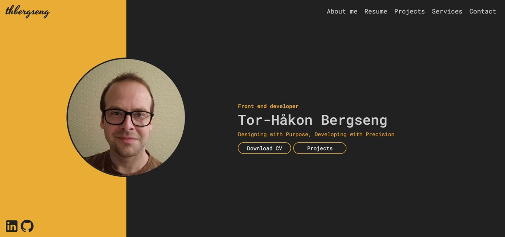

Portfolio 2



Live site <https://thbergseng-portfolio-2.netlify.app/>

## Description

Final task for my front-end development studies at Noroff. To create a personal portfolio page.


The portfolio consists of a single page application which is ready for future expansion when needed. 

- A main section introducing me as a developer
- An about section
- A resume section
- A projects section
- A services section
- A contact section

## Built With

- Vite
- React
- TypeScript
- Bootstrap
- React Bootstrap

## Getting Started

### Installing

1. Clone the repo:
    ```bash
    git clone [https://github.com/teehbee/portfolio_2]
    ```
    ```
    cd <your-project-folder>
    ```
2. Install dependencies
    ```bash
    npm install
    ```
3. Run application
    ```bash
    npm run dev
    ```

The application shall now run locally on your system

## Contributions

If you encounter any bugs or errors while using the application, feel free to contact me. Your feedback is greatly appreciated and will help improve the project.

## Contact

[My LinkedIn page](www.linkedin.com/in/tor-håkon-bergseng-981408250)

[My e-mail address](thbergseng@gmail.com)
